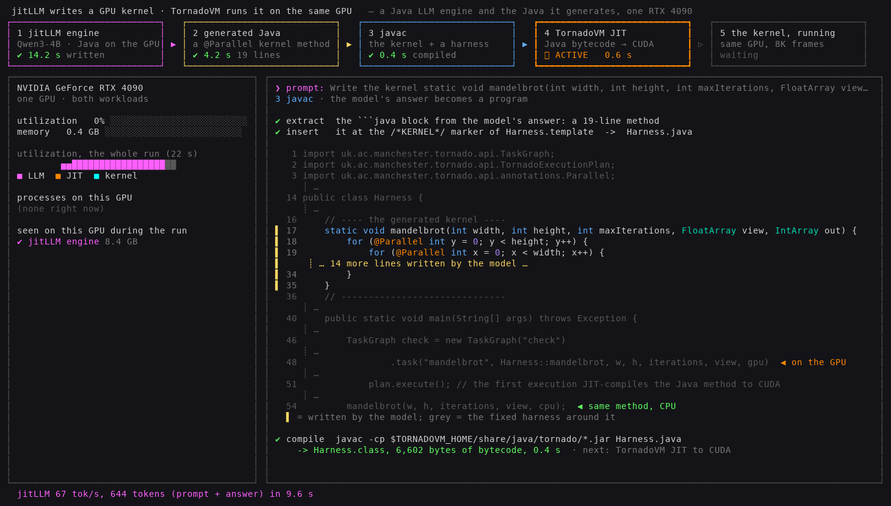

# 28 — An LLM in Java writes a GPU kernel in Java

An LLM runs in pure Java on the GPU ([jitLLM](https://github.com/beehive-lab/jitllm), Qwen3-4B F16) and writes a
Mandelbrot kernel as a plain Java method with `@Parallel` loops. TornadoVM JIT-compiles that method to CUDA and runs
it on the GPU. The *same* method then runs as ordinary Java on one CPU thread, as the reference. The two results are
compared pixel by pixel, and the fractal is drawn in the terminal from the GPU's output. About 15 s live, 2 s with
`--reference`.

```
    │ static void mandelbrot(int width, int height, int maxIterations, IntArray out) {
    │     for (@Parallel int y = 0; y < height; y++) {
    │         for (@Parallel int x = 0; x < width; x++) {
    ...                                                           (the model's code, streamed as it is generated)
    jitLLM: achieved tok/s: 67.13. Tokens: 559, seconds: 8.33 (prompt + answer)

    ┊ extern "C" __global__ void mandelbrot(long long *_kernel_context, ...      (TornadoVM's CUDA for that method)

    [the fractal, in color]

    same method, Java, 1 CPU thread    ██████████████████████████████████████████████   1,186.0 ms
    same method, GPU via TornadoVM     █                                                    3.1 ms ★
    99.79% of 12,582,912 pixels identical to the CPU run
LlmGpuKernel: PASSED -- the generated kernel ran on the GPU and matches the CPU on >= 99% of pixels
```

## The dashboard: `run.sh dashboard`

A full-screen live version for the stage (terminal ≥ 120 × 40, ~30 s). It makes one point obvious: **one GPU, two
Java workloads**. The Java LLM engine runs on the GPU and writes Java, and that Java then runs on the same GPU.



* **Pipeline row:** the five components are 1 jitLLM engine (Qwen3-4B), 2 generated Java, 3 javac, 4 TornadoVM JIT
  (Java → CUDA) and 5 the kernel running. Each is lit (heavy border, spinner, elapsed time) while it works and
  ticked with its time when done; the arrows light up as work flows.
* **GPU panel:** it polls `nvidia-smi` for utilization, memory, and **which process holds the GPU**. Each process
  is labelled and colored by the component that started it (matched through `/proc` parent PIDs).
  * The utilization timeline covers the whole run, each sample colored by the active component: a magenta LLM
    burst, then the cyan kernel load, on one device.
  * "Seen on this GPU during the run" lists both processes.
* **Content panel:**
  1. The prompt is typed out in a chat bubble, then the model's code streams in under it.
  2. The javac step shows extract → insert → compile: `Harness.java` with the model's lines marked yellow, arrows
     at the TornadoVM `.task(...)` (on the GPU) and the plain `mandelbrot(...)` call (the same method on the CPU),
     the `javac` command and the class size.
  3. Next comes the CUDA TornadoVM generated.
  4. Finally the kernel's own output: a zoom into Seahorse Valley, 100 frames at 7680 × 4320, one kernel execution
     per frame, paced at ~12 frames/s so the load shows on `nvidia-smi`. It is drawn with half-blocks and
     histogram colors.
* **Prompts and fallback:** `dashboard/prompt.txt` holds the user prompt for this view (the kernel takes its view
  window as a parameter, for the zoom), and the system prompt is the shared `system-prompt.txt`. If the live kernel
  fails to compile, javac turns red and `dashboard/reference.kernel` runs, labelled.
* **Logs:** `build/dashboard/`.

```bash
source scripts/setup-env.sh
export JITLLM_DIR=~/jitllm JITLLM_JAVA_HOME=~/.sdkman/candidates/java/21.0.2-open MODEL=~/models/Qwen3-4B-f16.gguf
bash demos/28-llm-writes-gpu-kernel/run.sh dashboard          # [enter] to leave; NO_PAUSE=1 exits by itself
```

Screenshots of a recorded run are in `dashboard/screenshots/` (generating, the javac step, the final screen).

## What is live, and what is fixed

| part | source |
|---|---|
| the kernel method | **generated live** by the model (`run.sh` without `--reference`); `build/generation.out` keeps the raw output |
| the CUDA shown | TornadoVM's own `printKernel` output for that method, this run |
| GPU and CPU times, the match, the image | measured and computed in this run (`build/run.log`) |
| `system-prompt.txt`, `prompt.txt` | fixed. They teach the TornadoVM rules with one example kernel, and give the signature, the coordinate ranges and the loop structure. The model writes the iteration and the TornadoVM idiom. |
| `Harness.template` | fixed: the class around the kernel, the GPU and CPU runs, the comparison, the image rows, the verdict |
| `reference.kernel` | the kernel the same model wrote for the same prompt in rehearsal. It is used with `--reference`, or, labelled, if a live kernel fails to compile. |

The model runs with temperature 0 (greedy), so the same prompt and model give the same kernel. In every run
recorded here it was byte-identical to `reference.kernel`, and it compiled the first time.

## What does this demonstrate?

* **Two kinds of Java on the GPU.** The first is the LLM's inference: jitLLM's own TornadoVM kernels, decode
  replayed as a CUDA graph. The second is the code it writes: a Java method, JIT-compiled to CUDA.
* **One method, two targets.** `mandelbrot(...)` runs as a TornadoVM task and is called directly as plain Java.
  Nothing in the method is GPU-specific beyond `@Parallel`.
* **Honest comparison.** 99.79% of pixels match. The rest differ by float rounding at the set's boundary (the GPU
  contracts multiply-adds into FMAs), so the check accepts ≥ 99%, not equality. The CPU time is one thread of plain
  Java, not a tuned CPU kernel.

## What TornadoVM feature/API does it use?

* `@Parallel` loops (2D), `IntArray`, `TaskGraph`, `TornadoExecutionPlan` with `DataTransferMode.EVERY_EXECUTION`.
* `tornado.printKernel` to show the generated CUDA.
* jitLLM (generation only) uses its own TornadoVM build; the kernel runs on the repo's TornadoVM 7.0.0.

## Prerequisites

* For `--reference`, everything in the top-level README (TornadoVM 7.0.0 CUDA via `scripts/setup-env.sh`) and
  Python 3. That runs the GPU half for anyone.
* For live generation, also a built [jitLLM](https://github.com/beehive-lab/jitllm) clone with its TornadoVM
  (`scripts/tornadovm-dev.sh setup --backend cuda --jdk 21`), its JDK 21, and the Qwen3-4B F16 GGUF (7.5 GB; it
  needs about 10 GB of device memory). Recorded with jitLLM `main` at `d875f083`.

Smaller models were tried and did worse. Llama-3.2-3B's kernel did not compile. Asking either model for a whole
TornadoVM program, not just the kernel, failed to compile or produced wrong results. That is why the model writes
only the method and the harness does the rest.

## How do I run it?

```bash
source scripts/setup-env.sh
bash demos/28-llm-writes-gpu-kernel/run.sh --reference           # no LLM: the rehearsal kernel, ~2 s
bash demos/28-llm-writes-gpu-kernel/run.sh java --reference      # the same via java @argfile

export JITLLM_DIR=~/jitllm JITLLM_JAVA_HOME=~/.sdkman/candidates/java/21.0.2-open MODEL=~/models/Qwen3-4B-f16.gguf
bash demos/28-llm-writes-gpu-kernel/run.sh                       # the model writes the kernel live, ~15 s
```

## How do I validate the result?

`LlmGpuKernel: PASSED` requires the GPU result to equal the CPU result, from the same Java method, on at least 99%
of the 12,582,912 pixels. A kernel that compiles but computes something else fails. A kernel that does not compile
stops the `--reference` run, and shows its compiler errors before the labelled fallback in a live run.

## What GPU/CUDA requirements exist?

Any CUDA GPU TornadoVM 7.0.0 supports, for the kernel (48 MB of device memory). Live generation needs room for the
model (Qwen3-4B F16: about 10 GB with a 2048-token context).

## What should the presenter point out?

* The code appears token by token, written by a model that is itself Java running on the GPU.
* The CUDA excerpt: TornadoVM turned the model's Java into that, at run time.
* The fractal is the GPU's actual output, drawn in the terminal. 3 ms on the GPU against 1.2 s for the same method
  on one CPU thread.
* If generation misbehaves on stage, `run.sh --reference` takes 2 s and shows the same GPU half.

## Provenance

Captured on the sm_89 host: RTX 4090, driver 610.57.04, JDK 25.0.2 for the kernel, JDK 21 for jitLLM, and the
TornadoVM 7.0.0 release (SDKMAN `7.0.0-jdk22plus-cuda`). See `results/raw/48-llm-writes-gpu-kernel/MANIFEST.md`.
